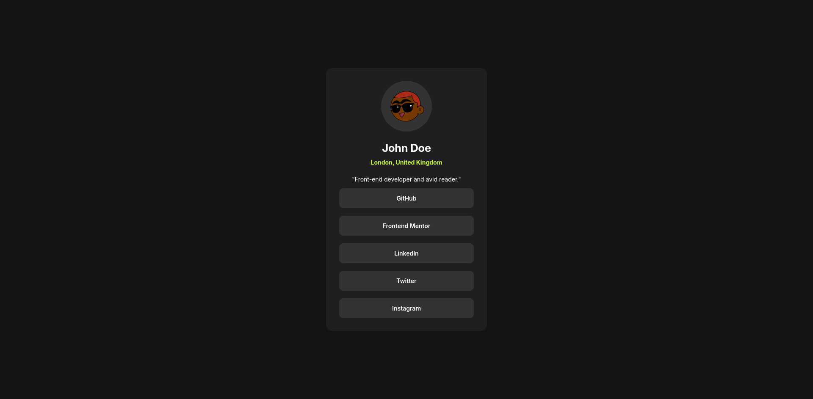

# Frontend Mentor - Social links profile

This is a solution to the [Social links profile challenge on Frontend Mentor](https://www.frontendmentor.io/challenges/social-links-profile-UG32l9m6dQ).

## Overview

### The challenge

Users should be able to:

- See hover and focus states for all interactive elements on the page

### Screenshot

## Built with

- Semantic HTML5 markup
- CSS custom properties
- Flexbox
- Media queries

### Useful links

- [Avatars for profiles](https://www.dicebear.com/)
- [Learn CSS Flexbox in 20 minutes (course)](https://www.youtube.com/watch?v=wsTv9y931o8&t=1101s)
